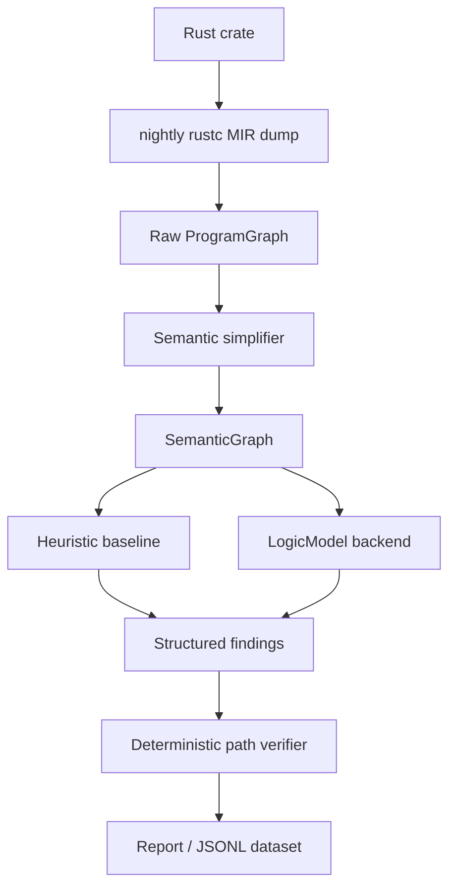
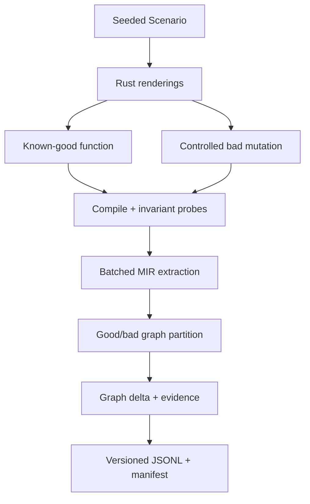

# MIR Logic-AI

`mir-logic` is an experimental vertical prototype for one research question:

> Does Rust MIR retain enough structural and semantic information for a model to notice suspicious logic-flow connections which are valid executions, but likely violate a program invariant?

The initial result is promising but deliberately narrow. The controlled corpus detects all six injected bad cases and leaves all five good cases clean. That is evidence that the representation works for these examples, **not** evidence that every finding is a bug or that the detector generalizes to real projects.

## Why MIR?

Source text is semantically rich but makes control-flow reconstruction expensive and error-prone. LLVM IR has a precise CFG but has already lost much Rust-level information. MIR sits in a useful middle ground: explicit basic blocks, calls, unwind targets, discriminants, typed locals, ADT projections, debug variable names, and Rust-shaped operations.

This prototype uses nightly `-Zdump-mir=built`. `rustc_public` was considered first, but the dumped format is currently the fastest way to test the hypothesis without coupling the entire project to one nightly's compiler crates. All nightly-specific work lives in `extractor.rs`, behind `GraphExtractor`; replacing it with `rustc_public` does not affect models, verification, reporting, or datasets.



The AI proposes a semantic invariant and suspicious node path. The verifier checks that every node and every consecutive control edge actually exists. A confirmed graph path proves reachability in the extracted graph; it does **not** prove that the path is feasible under all data constraints, nor that the behavior is a bug.

## What survives extraction

The raw graph retains:

- functions, basic-block membership, assignments, calls, arguments and destinations;
- returns, `SwitchInt`, assertions, unreachable/resume nodes, normal and unwind successors;
- locals, types, mutability, `debug` variable names, projections and recognizable variants;
- compiler-form text alongside semantic names;
- lightweight reads/writes and def-use edges;
- small source snippets and file/line locations for calls when source lookup is unambiguous;
- the full per-function raw MIR, including rustc source scopes, when `extract` is used.

`Result` and `Option` discriminants are rendered as `Result::Ok`, `Result::Err`, `Option::Some`, and `Option::None` when this is reliable. Opaque compiler locals remain available when symbolic recovery fails.

The semantic graph contracts storage/fake-read noise while retaining calls, branches, returns, errors, assertions, variant projections, state-like assignments, typed branch labels, def-use edges, and calls to functions in the current crate. Dependencies and the standard library are not expanded.

## Build and run

Nightly is selected by `rust-toolchain.toml`.

```bash
cargo build
cargo run -- extract examples/auth_bad_session --format json > graph.json
cargo run -- graph examples/auth_bad_session --function login --format dot > login.dot
cargo run -- analyze examples/auth_bad_session --model mock
cargo run -- analyze examples/auth_good --model mock
cargo run -- eval
```

The key experiment produces a compiler-confirmed semantic path like:

```text
authenticate
  -> Result::Err
report_auth_failure
  -> default_user
create_session
```

The good authentication example produces no corresponding high-confidence finding.

`--call-depth 0` disables crate-local call edges; positive depths retain them and are recorded in the graph/run context. Function bodies remain available independently so later graph-native models can choose their own expansion policy.

## Model backends

`--model mock` is deterministic and offline. It exercises the same structured output, verification, storage, and reporting path as a real backend, while using semantic path patterns internally. It is useful for tests, not a substitute for an LLM.

`--model openai-compatible` uses a provider-neutral Chat Completions-compatible endpoint:

```bash
export MIR_LOGIC_API_BASE=https://provider.example/v1
export MIR_LOGIC_API_KEY=...
export MIR_LOGIC_MODEL=model-name
cargo run -- analyze path/to/crate --model openai-compatible
```

`OPENAI_API_KEY` is accepted as a fallback. No provider is embedded in the graph or verification layers. The prompt requests strict JSON and requires node IDs. Invalid nodes or invented path edges are explicitly rejected.

Use `--model none` to run only the heuristic baseline, or `--no-heuristics` to isolate model output.

## Baselines and corpus

The naming-based rules are intentionally labeled heuristics. They detect failure variants/negative checks reaching session creation, sensitive operations, commits, invalid state transitions, or resource use without recognizable recovery. A small dominance-style rule looks for sensitive operations reachable while avoiding a recognizable permission check.

The corpus contains paired good/bad crates for authentication, permissions, `Result` handling, state transitions, and resource lifecycle, plus a second authentication fallthrough. Expected labels live in each example's `Cargo.toml` under `package.metadata.mir_logic`.

```bash
cargo run -- eval --format json
```

Evaluation reports TP, FP, TN, FN, precision, and recall separately for heuristics, mock AI, and their union.

## Mutations and training data

Source-level mutations are intentionally simple and auditable:

```bash
cargo run -- mutate src/input.rs /tmp/mutant.rs \
  --mutation remove_auth_failure_return
```

Supported mutation names include `remove_auth_failure_return`, `invert_boolean_condition`, `and_to_or`, `remove_permission_call`, `ignore_error_result`, `swap_match_arms`, and `remove_state_validation`.

Every `analyze` run writes a reusable JSON report under `.mir-logic/runs`. Export finding records as JSONL:

```bash
cargo run -- dataset export .mir-logic/runs --output dataset.jsonl
cargo run -- label heuristic-authentication_bypass-login--bb10--n0 bug
```

Create a contrastive good/bad graph record after producing a mutated crate:

```bash
cargo run -- dataset pair examples/auth_good examples/auth_bad_session \
  --mutation remove_auth_failure_return --output .mir-logic/runs/auth-pair.json
```

Records expose stable string node IDs, node features, semantic text, types, branches, edge types, source information, findings, verification, labels, and human-feedback slots. They are suitable starting points for a GNN, graph transformer, code encoder plus GNN, path classifier, edge anomaly model, or contrastive graph model. No model is trained here.

## Tests

```bash
cargo fmt --check
cargo clippy --all-targets --all-features -- -D warnings
cargo test
```

Unit tests cover parsing, graph serialization, simplification, model output, path verification, mutations, and metrics. Integration tests compile and analyze the example crates through real nightly MIR.

## Current limitations

- Dumped MIR is an unstable textual interface. The parser is isolated but will need fixtures/updates as nightly formatting changes.
- Source attachment is a conservative source-text lookup, not rustc's full `SourceMap`. Calls get useful snippets; arbitrary statements do not yet receive exact spans. Raw MIR preserves available scope material.
- Variant recovery is strongest for `Result`, `Option`, and projections printed by MIR. A niche-optimized or single-variant enum can erase the exact source variant name.
- Def-use is lightweight and not SSA, alias-aware, or interprocedural.
- Verification checks graph path integrity and simple contradictory branch reuse. General feasibility needs symbolic execution, SMT, or rustc dataflow integration and is reported as `UNKNOWN`.
- Names such as `authenticate` and `create_session` are hints, not universal truths. Real projects will create false positives and false negatives.
- The OpenAI-compatible backend has not been used in the offline test suite and provider response dialects vary.
- Rebuilding into a temporary target directory guarantees fresh MIR but can be expensive for dependency-heavy crates. Only the current crate is semantically expanded.

The prototype therefore supports the modest conclusion that MIR preserves enough information to expose several meaningful semantic relationships—especially typed failure/success branches connected to stateful calls—and that an AI can be placed above a compiler-verified graph without being trusted as the verifier. General usefulness still requires a larger real-world labeled corpus and stronger feasibility analysis.

## Large-scale synthetic corpus generator

The second milestone adds a reproducible, compiler-validated dataset pipeline. `--count` is the number of semantic **pairs**; each pair produces one good and one bad record.

```bash
cargo run --release -- dataset generate \
  --count 1000 \
  --seed 42 \
  --split \
  --batch-size 100 \
  --output /tmp/mir-logic-dataset
```

The same seed and configuration select the same scenarios and render the same Rust source. Wall-clock timings in `manifest.json` naturally differ. Large generated crates are temporary and are never committed.



### Diversity dimensions

The generator separates semantic scenarios from source rendering and currently covers:

- nine domains: authentication, authorization, validation, resource lifecycle, transactions, state machines, initialization, guarded state, and capability checks;
- eight topologies: `match`, `if let`, early return, boolean guard, `Option` match, nested branches, `let else`, and deep helper chains;
- primary, alternate, and evaluation-only holdout vocabularies for every domain;
- semantic, neutral, and deterministic-random identifiers;
- unit structs, tuple newtypes, struct fields, enums, booleans, and integer state codes;
- custom enum errors, custom struct errors, unit errors, `Option`, and booleans;
- call depths from direct calls through five helper boundaries;
- deterministic irrelevant computations and structural noise.

Every generated batch contains executable invariant probes. For a failed precondition, the good controller must return `false` and the mutated controller must return `true`. `cargo test` runs these safe, self-contained probes before MIR extraction. Both sides therefore compile and the declared semantic difference is executed, not merely assumed from a textual edit.

Mutations have checked rendering preconditions and include failure fallthrough, permission/validation/guard bypasses, use after close, commit on failure, invalid failure transitions, missing initialization, and missing capability/state requirements. The standalone mutation engine also exposes controlled forms of condition inversion, arm swapping, result ignoring, operation reordering, use before open, commit after rollback, and incorrect state transitions.

### Anti-shortcut challenge sets

With `--split`, challenge records are included in `test.jsonl` and also materialized under `challenges/`:

- `identifier_blind.jsonl` — neutral identifiers such as `operation_a`;
- `unseen_vocabulary.jsonl` — domain vocabularies absent from ordinary training records;
- `unseen_topology.jsonl` — held-out CFG templates;
- `deep_call_graph.jsonl` — consequences three to five calls from the failed check;
- `noise.jsonl` — unrelated computations and larger graphs;
- `hard_negative.jsonl` — a suspiciously named failure-side operation which is explicitly benign, while the truly privileged consequence is distinct.

The last set intentionally creates false positives for name-based rules. If a detector remains nearly perfect there, inspect the dataset for another shortcut.

Splits are assigned at the origin-group level, using domain, template, vocabulary family, identifier mode, and challenge family. A good/bad pair can never cross splits. Held-out vocabularies and topologies are always assigned to test; `Option`/nested templates form validation; remaining standard templates form training. The generator rejects a run if an origin group maps to multiple splits.

### Versioned records and graph deltas

Schema version 2 records contain:

- stable record, pair, scenario, seed, split, domain, and dataset identifiers;
- source and optional raw MIR;
- the semantic graph with node features and typed edges;
- strong good/bug labels, invariant, bug type, and controlled mutation;
- source-region evidence and resolved MIR check/consequence/failure-edge evidence;
- template, vocabulary, identifier, state/error representation, call depth, noise, and transformations;
- aligned added/removed nodes and edges plus changed node features.

Alignment normalizes the generated `good`/`bad` prefixes and compares stable semantic features. It deliberately does not claim perfect graph isomorphism.

`manifest.json` reports domain/mutation/template/split/challenge distributions, state and error representations, average nodes/edges/call depth, exact graph duplicates, compilation/generation rejection counts, and separate generation, compile-test, MIR-extraction, and graph-processing timings.

The JSONL schema is intentionally flat at the record level and uses ordinary arrays/maps, so a future Python loader can stream it without adding PyTorch to this Rust project:

```python
import json

with open("dataset/train.jsonl") as records:
    for line in records:
        record = json.loads(line)
        nodes = record["graph"]["functions"][0]["nodes"]
        label = record["label"] == "bug"
```

## Generated-corpus benchmarks

The benchmark command supports the deterministic heuristic, offline mock detector, and configured OpenAI-compatible model:

```bash
cargo run --release -- benchmark \
  --model heuristic \
  --dataset /tmp/mir-logic-dataset/test.jsonl \
  --input-mode semantic-graph-only
```

LLM experiments can use the same held-out records in four modes:

```bash
for mode in source-only semantic-graph-only source-plus-graph raw-mir-only; do
  cargo run --release -- benchmark \
    --model openai-compatible \
    --dataset /tmp/mir-logic-dataset/test.jsonl \
    --input-mode "$mode" \
    --cache-dir /tmp/mir-logic-cache
done
```

Generation-only source markers are removed before LLM prompting. Responses are cached by dataset version, record, model, prompt version, input mode, ablations, temperature, and payload. Cache metadata records the model, prompt and dataset versions, settings, timestamp, confidence, prediction, and token usage when supplied. API keys are read only from the environment and are never written.

Available graph ablations are `names`, `types`, `data-flow`, `source-snippets`, `variant-names`, and `cfg-only`:

```bash
cargo run --release -- benchmark \
  --model openai-compatible \
  --dataset /tmp/mir-logic-dataset/test.jsonl \
  --input-mode semantic-graph-only \
  --ablate names --ablate data-flow
```

Name ablation renumbers functions/nodes and removes calls, variables, arguments, read/write names, compiler text, and source text while preserving separately ablatable types and variants. CFG-only retains control-relevant node kinds and non-data-flow edges.

Reports contain accuracy, precision, recall, F1, false-positive rate, and false-negative rate overall and grouped by domain, mutation, template, call depth, identifier mode, and challenge set. Use `--format json` for complete predictions and breakdowns. Use `--limit` for an inexpensive LLM smoke benchmark.

The intended experiments are:

1. compare source-only, graph-only, and source-plus-graph on identical records;
2. compare normal and identifier-blind records;
3. compare seen and held-out templates/vocabularies;
4. ablate names, types, variants, data flow, and source snippets independently;
5. compare every result against deterministic heuristics, especially hard negatives.

No neural model is trained in this repository. This milestone produces and audits the evidence a later graph-aware training pipeline would consume.
